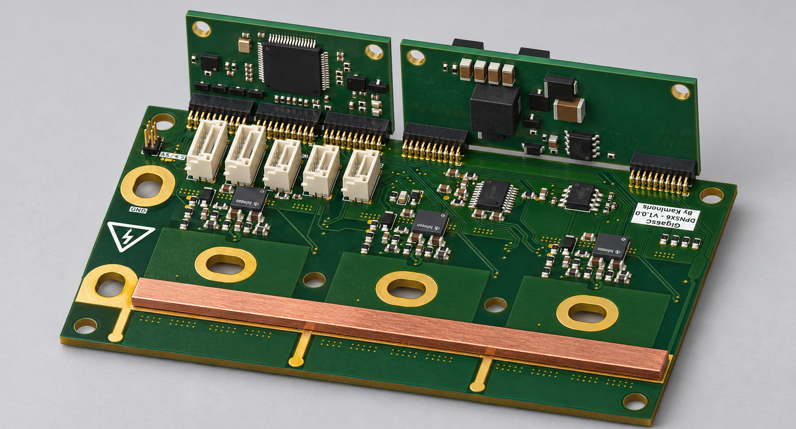
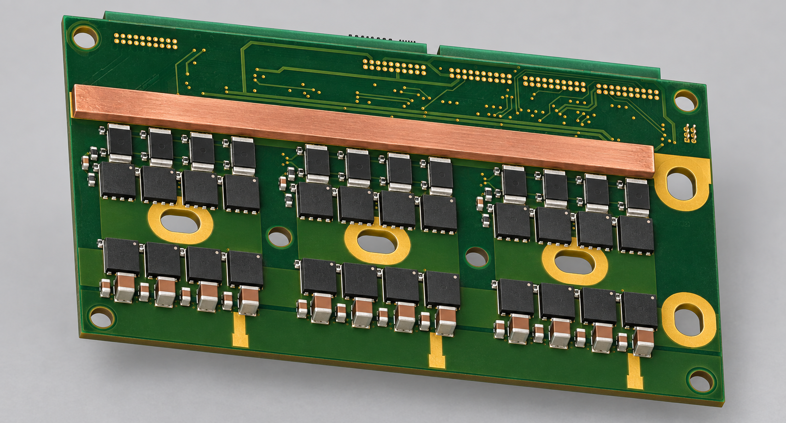

# GigaDFN56

Compact, modular three-phase ESC power board for the GigaESC project. Designed in KiCad 10 on a 100 × 60 mm, four-layer PCB, with separate plug-in control and power-supply boards.

## Board views

## Hardware

- 24 Infineon ISC030N10NM6 MOSFETs: four in parallel per switch, each with an individual 4.7 Ω gate resistor.
- Three 2EDF7275K dual gate drivers with bootstrap high-side supplies.
- Four parallel 1 mΩ low-side shunts per phase, sensed by an INA4181A1. Nominal sensitivity: 5 mV/A, centred on a buffered half-reference voltage.
- Phase-voltage, bus-voltage and temperature sensing.
- Copper busbars and bolted power/phase connections.

## Interfaces

- **J31–J33:** control-board interface, using three 1 mm pitch 2×10 connectors.
- **J41:** DC bus input to the power-supply module.
- **J42:** 12 V, 5 V and 3.3 V supply interface.
- **J1–J5:** vertical JST-GH external connections. USB signals share a connector with SERVO; USB power is not routed.

See `Connectors.kicad_sch` for authoritative pin assignments. The module interfaces are non-isolated.

## Project files

Open `GigaDFN56.kicad_pro`. The root schematic is `GigaDFN56.kicad_sch`; PCB layout is in `GigaDFN56.kicad_pcb`. Local symbols and footprints are included in `GigaDFN56.kicad_sym` and `GigaDFN56.pretty`.

## Status

Prototype design; electrical and thermal performance still require bench validation. The 100 V MOSFET rating is not a validated operating-bus rating. Gate-drive tuning, switching overshoot, current-sense behaviour and cooling must be checked on hardware.

